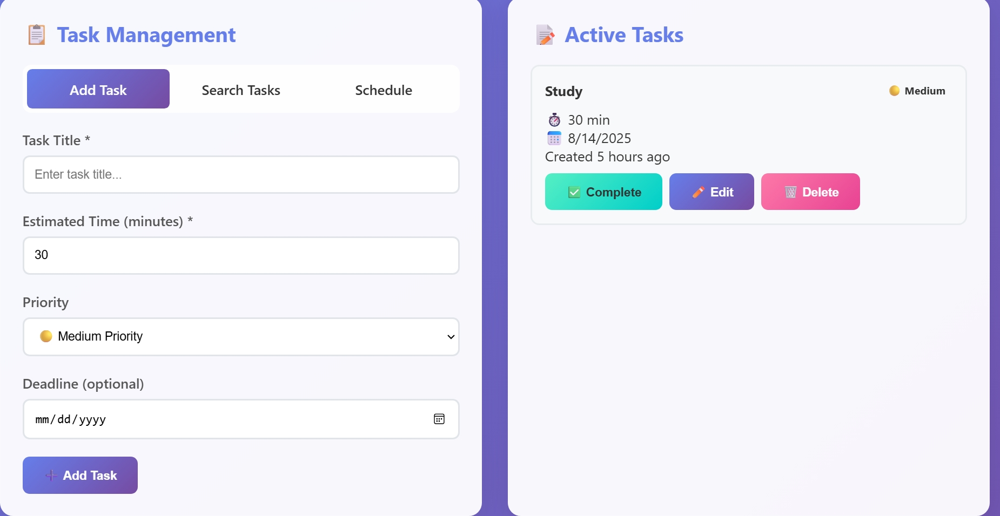
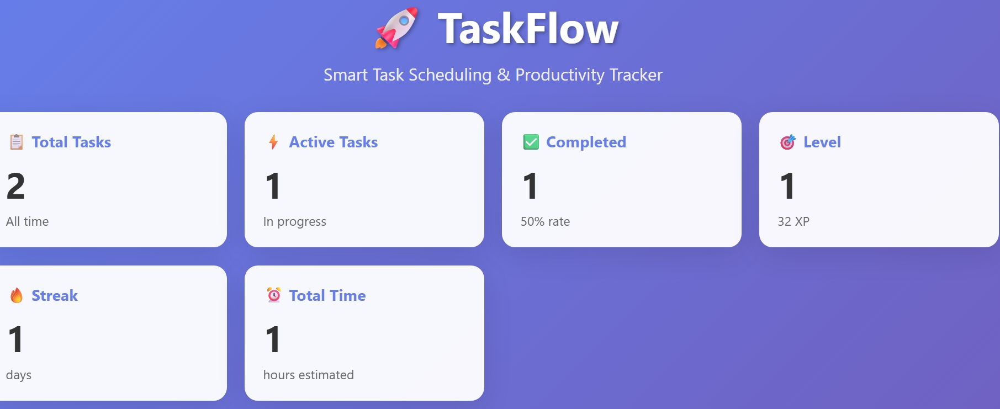

# 📅 Schedulo – Smart Scheduling & Task Management App

Schedulo is a full-stack Python-based web application built with Flask and modern JavaScript. It helps users manage tasks, generate schedules, and analyze productivity using a clean modular backend and an interactive frontend.

---

## 📸 UI Preview

### 🖼️ Dashboard View


### 🖼️ Analytics or Task View


---

## 🚀 Features

- ✅ Modular Flask backend with Blueprints  
- 📊 Task tracking and scheduling  
- 📈 Analytics and productivity insights  
- 🔄 RESTful API integration with JavaScript `fetch()`  
- 🧩 Scalable project structure for future expansion  

---

## 🛠️ Tech Stack

| Layer         | Tech Used                     |
|--------------|-------------------------------|
| Backend       | Python, Flask, Blueprints     |
| Frontend      | HTML, CSS, JavaScript (Vanilla) |
| Database      | SQLite / SQLAlchemy (ORM)     |
| Deployment    | Localhost / Gunicorn-ready    |

---

## 📁 Project Structure

```bash
schedulo/
│
├── app/
│   ├── __init__.py          # Initializes Flask app
│   ├── models/              # SQLAlchemy models
│   ├── routes/              # Modular route files (Blueprints)
│   ├── services/            # Business logic / analytics
│   └── static/              # Frontend JS, CSS
│
├── templates/               # Jinja2 HTML templates
├── venv/                    # Python virtual environment
├── main.py                  # Entry point (optional)
├── requirements.txt         # Project dependencies
└── README.md                # You're here
````

---

## ⚙️ Getting Started

### 1. Clone the Repository

```bash
git clone https://github.com/KIREN2612/schedulo.git
cd schedulo
```

### 2. Set Up Virtual Environment

```bash
python -m venv venv
venv\Scripts\activate   # On Windows
# source venv/bin/activate   # On macOS/Linux
```

### 3. Install Dependencies

```bash
pip install -r requirements.txt
```

### 4. Run the Flask App

```bash
# Option 1: Run via Python
python app/__init__.py

# Option 2: If using main.py
python main.py
```

> App will be running on: `http://127.0.0.1:5000/`

---

## 🧪 Testing Endpoints

Use tools like **Postman**, **curl**, or browser `fetch()` to call:

* `GET /tasks`
* `POST /tasks`
* `GET /schedule`
* `POST /analytics`

---

## 📦 Deployment (optional)

To deploy with Gunicorn (on Linux):

```bash
pip install gunicorn
gunicorn -w 4 -b 0.0.0.0:5000 app:app
```

---

## ✅ TODO / Future Features

* [ ] User authentication and sessions
* [ ] Dark mode UI
* [ ] Task notifications and reminders
* [ ] Export schedules to PDF/CSV
* [ ] Mobile responsiveness

---

## 🧑‍💻 Author

**Kiren S**
Made with ❤️ using Flask and vanilla JS.

---

## 📜 License

This project is licensed under the MIT License - see the [LICENSE](LICENSE) file for details.

````

